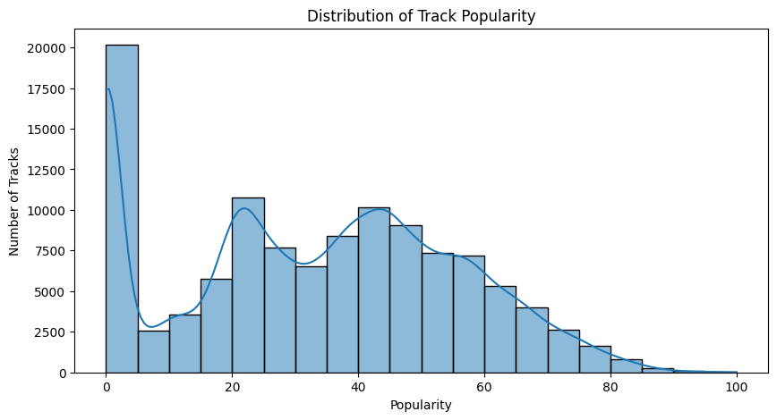
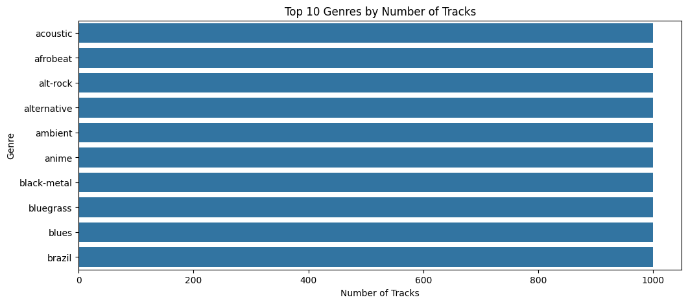
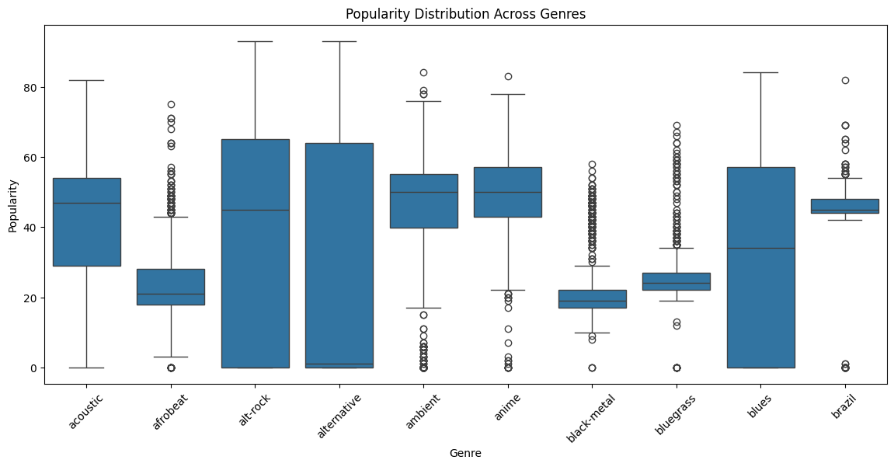
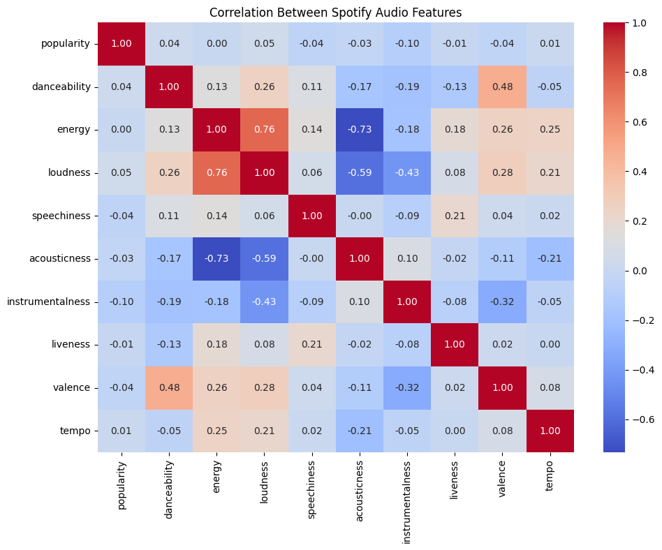
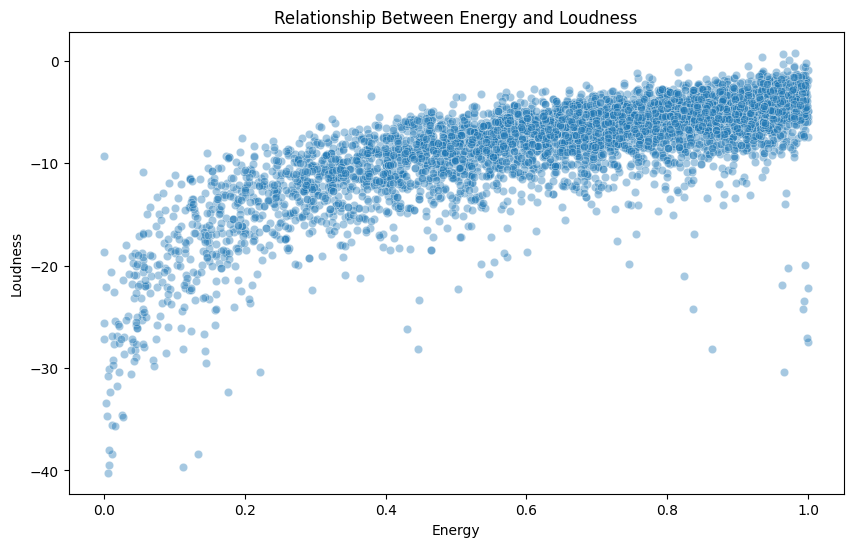
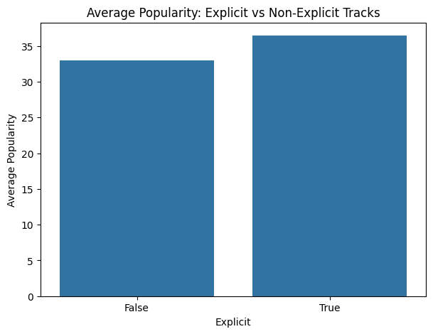

# 🎵 Spotify Tracks Dataset – EDA & Data Visualization

**Name:** Milan Sijo  
**MUID:** milansijo@mulearn

---

## 📖 Project Overview

This project was completed as part of the **Epochs: Data Science Bootcamp '26 - Day 04 Assignment**.

The objective is to perform **Exploratory Data Analysis (EDA)** on the Spotify Tracks Dataset and create compelling visualizations using **Matplotlib** and **Seaborn**. The goal is not just to create charts, but to communicate insights through effective **data storytelling**.

---

## 📂 Dataset

**Dataset:** Spotify Tracks Dataset

**Source:** [Kaggle - Spotify Tracks Dataset](https://www.kaggle.com/datasets/maharshipandya/-spotify-tracks-dataset)

The dataset contains information about Spotify tracks across various genres, including:

- Track Name & Artist(s)
- Album Name
- Popularity Score
- Duration
- Explicit Content Flag
- Audio Features: `danceability`, `energy`, `loudness`, `speechiness`, `acousticness`, `instrumentalness`, `liveness`, `valence`, `tempo`
- Track Genre

---

## 🔍 Part 1: Exploratory Data Analysis

Exploratory Data Analysis was performed to understand the structure, quality, and characteristics of the dataset.

The analysis included:

- Examining the dataset shape and structure using `.shape` and `.info()`
- Identifying numerical and categorical features
- Performing descriptive statistical analysis using `.describe()`
- Checking for missing values using `.isnull().sum()`
- Checking for duplicate records using `.duplicated().sum()`
- Understanding relationships between different audio features

---

## 📈 Part 2: Data Visualization & Storytelling

Six meaningful visualizations were created using four different chart types (Histogram, Bar Chart, Box Plot, Heatmap, and Scatter Plot) to explore and communicate patterns in the dataset.

---

### Visualization 1: Distribution of Track Popularity

**Chart Type:** Histogram with KDE



**Insight:** The popularity distribution is heavily right-skewed, with a very large spike at 0 (over 20,000 tracks). This indicates that a significant portion of tracks on Spotify receive very little to no engagement. Beyond the zero-popularity spike, the distribution shows a roughly normal shape centered around 40–50, suggesting that among tracks that do gain traction, moderate popularity is the most common outcome. Very few tracks achieve popularity scores above 80, confirming that viral-level success is rare.

---

### Visualization 2: Top 10 Genres by Number of Tracks

**Chart Type:** Horizontal Bar Chart



**Insight:** The top 10 genres each contain approximately 1,000 tracks, indicating that the dataset is well-balanced across genres. Genres such as acoustic, afrobeat, alt-rock, alternative, ambient, anime, black-metal, bluegrass, blues, and brazil all have nearly equal representation. This uniform distribution suggests the dataset was curated to provide equal representation across genres, making it suitable for fair cross-genre comparisons without bias toward any particular genre.

---

### Visualization 3: Popularity Distribution Across Genres

**Chart Type:** Box Plot



**Insight:** Despite having similar track counts, genres show vastly different popularity distributions. **Alt-rock** has the highest median popularity (~45) with a relatively compact interquartile range, indicating consistently popular tracks. In contrast, **alternative** and **ambient** genres show extremely wide spreads with medians near 0, meaning most tracks in these genres have very low popularity despite some outliers reaching 80+. **Black-metal** and **bluegrass** tend to cluster at lower popularity scores. This reveals that genre alone plays a significant role in determining a track's potential reach on the platform.

---

### Visualization 4: Correlation Between Spotify Audio Features

**Chart Type:** Heatmap



**Insight:** The correlation heatmap reveals several strong relationships between audio features. The most notable correlation is between **energy and loudness (0.76)**, indicating that louder tracks tend to be more energetic. A strong negative correlation exists between **energy and acousticness (-0.73)** and **loudness and acousticness (-0.59)**, showing that acoustic tracks are generally quieter and less energetic. **Danceability and valence (0.48)** are moderately correlated, suggesting that more danceable tracks tend to have a more positive musical mood. Notably, **popularity shows very weak correlations** with all audio features (all near 0), implying that a track's success on Spotify is driven by factors beyond its audio characteristics alone (such as artist fame, marketing, and playlist placement).

---

### Visualization 5: Relationship Between Energy and Loudness

**Chart Type:** Scatter Plot



**Insight:** The scatter plot visually confirms the strong positive correlation (0.76) between energy and loudness. As energy increases, loudness values rise (moving from around -40 dB to near 0 dB). The relationship is approximately linear for mid-to-high energy tracks, but low-energy tracks show much greater variance in loudness. A few outlier tracks exist with high energy but very low loudness (and vice versa), but the overall trend is clear: louder production is closely tied to a track's perceived energy level. This insight is valuable for music producers aiming to control the energetic feel of their tracks through loudness levels.

---

### Visualization 6: Average Popularity – Explicit vs Non-Explicit Tracks

**Chart Type:** Bar Chart



**Insight:** Explicit tracks have a slightly higher average popularity (~36) compared to non-explicit tracks (~33). While the difference is modest, it suggests that tracks with explicit content tend to perform marginally better on the platform. This could reflect listener preferences in popular genres like hip-hop and rap, where explicit content is more prevalent. However, the small gap indicates that explicit content alone is not a major driver of popularity.

---

## 💡 Overall Conclusions

1. **Popularity is heavily skewed.** The majority of Spotify tracks have very low popularity scores, with a massive concentration at zero. Only a small fraction of tracks achieve high popularity, highlighting how competitive the platform is.

2. **Genre significantly influences popularity.** Genres like alt-rock consistently achieve higher popularity scores, while genres like black-metal and ambient tend to cluster at lower popularity levels despite having equal representation in the dataset.

3. **Audio features are interconnected but don't predict popularity.** Strong correlations exist between features like energy–loudness and energy–acousticness, but none of the audio features show a meaningful correlation with popularity. This suggests that commercial success depends on external factors such as artist recognition, playlist placement, and marketing rather than the sonic characteristics of a track.

4. **Energy and loudness are tightly linked.** The strongest feature-to-feature relationship in the dataset is between energy and loudness (r = 0.76), confirming the intuitive connection between a track's perceived intensity and its production volume.

5. **Danceability correlates with positive mood.** Tracks that are more danceable also tend to have higher valence (more positive, happy sound), which aligns with the expectation that upbeat music encourages movement.

6. **Explicit content has a marginal popularity edge.** Explicit tracks are slightly more popular on average, likely driven by the dominance of explicit content in trending genres like hip-hop and pop.

---

## 🛠️ Tech Stack

### Libraries

- Python 3
- Pandas
- NumPy
- Matplotlib
- Seaborn
- Kaggle Notebooks

---

## 📂 Project Structure

```text
Day04/
├── Day4_Visualization.ipynb
├── Images/
│   ├── viz_01.png
│   ├── viz_02.png
│   ├── viz_03.png
│   ├── viz_04.png
│   ├── viz_05.png
│   └── viz_06.png
└── README.md
```

---

## ⚙️ Installation

Clone the repository:

```bash
git clone https://github.com/milansijo/Epochs-Data-Science-Bootcamp.git
```

Navigate to the project:

```bash
cd Epochs-Data-Science-Bootcamp/Day04
```

Install the required Python libraries:

```bash
pip install pandas numpy matplotlib seaborn
```

---

## ▶️ Run Locally

1. Open `Day4_Visualization.ipynb` using Kaggle, Google Colab, or Jupyter Notebook.

2. Run all notebook cells to reproduce the EDA and visualizations.

---

## 🎯 Learning Outcomes

This project demonstrates:

- Exploratory Data Analysis (EDA)
- Data Visualization using Matplotlib and Seaborn
- Data Storytelling and Insight Communication
- Statistical Analysis of Audio Features
- Cross-Genre Comparison and Analysis

---

## 👨‍💻 Author

**Milan Sijo**

**MUID:** milansijo@mulearn

---

## 📄 License

This project was developed as part of the **Epochs Data Science Bootcamp – Day 04 Assignment** for educational purposes.
